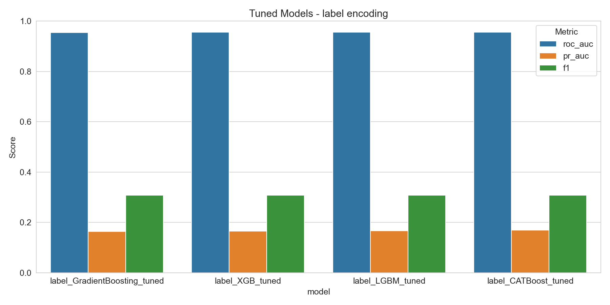

# Fraud Detection in Nigerian Mobile Money Transactions

Проект по обнаружению мошеннических транзакций в нигерийской системе мобильных денег.  
Включает исследовательский анализ данных (EDA), генерацию признаков, сравнение трёх методов кодирования категориальных переменных и обучение четырёх реализаций градиентного бустинга (sklearn, XGBoost, CatBoost, LightGBM) с автоматической настройкой гиперпараметров с помощью Optuna. Все эксперименты логируются в MLflow.

## Оглавление
- [Fraud Detection in Nigerian Mobile Money Transactions](#fraud-detection-in-nigerian-mobile-money-transactions)
  - [Оглавление](#оглавление)
  - [Данные](#данные)
  - [Структура проекта](#структура-проекта)
  - [Установка и настройка](#установка-и-настройка)

## Данные
Используется открытый датасет [Nigerian Banking Mobile Money](https://huggingface.co/datasets/electricsheepafrica/nigerian-banking-mobile-money) с более чем 4 млн транзакций.

**Целевая переменная:** `fraud_flag` (1 – мошенничество, 0 – норма).  
**Дисбаланс классов:** около 1.5% мошеннических операций.

## Структура проекта
.  
├── data/  
│ └── raw/  
│ └── nigerian_mobile_money_full.parquet # основной файл данных  
├── notebooks/  
│ └── fate_eda.ipynb # ноутбук с полным пайплайном  
├── models/  
│ └── artifacts/ # сохранённые графики и отчёты  
│ ├── Default_Models_-label_encoding.png  
│ ├── Tuned_Models-_label_encoding.png  
│ └── final_report_encoding_comparison.md  
├── mlruns/ # директория логов MLflow (создаётся автоматически)  
├── requirements.txt  
└── README.md  

## Установка и настройка

1. **Клонируйте репозиторий** и перейдите в папку проекта.  

2. **Создайте виртуальное окружение** (рекомендуется Python 3.11):  

   python -m venv venv  
   source venv/bin/activate      # Linux/macOS  
   venv\Scripts\activate         # Windows  

3. **Установка зависимостей** из файла requirements.txt:   
   pip install -r requirements.txt  
4. **Скачайте данные** и поместите файл nigerian_mobile_money_full.parquet в папку data/raw/.  
Ссылка на скачивание: HuggingFace Dataset https://huggingface.co/datasets/electricsheepafrica/africa-financial-inclusion-nigeria  
Запуск  
Весь код находится в ноутбуке notebooks/fate_eda.ipynb.  
Откройте его в Jupyter Lab / Jupyter Notebook и выполните ячейки последовательно.  

Что делает ноутбук:  

Загружает данные и проводит EDA (сохраняет графики в reports/figures/)  

Создаёт временные и числовые признаки  

Применяет три метода кодирования категориальных признаков:  

- One‑Hot Encoding  

- Label Encoding (OrdinalEncoder)  

- Target Encoding  

Для каждого метода обучаются четыре модели градиентного бустинга с параметрами по умолчанию  

Настраивает гиперпараметры каждой модели с помощью Optuna (с ограничением по времени и балансировкой обучающих фолдов)  

Сравнивает качество моделей (ROC‑AUC, PR‑AUC, F1)  

Логирует все эксперименты в MLflow  

**Результаты**  
Базовые модели (параметры по умолчанию)  

|Encoding	|Model|	ROC-AUC|	PR-AUC|	F1|
|-------|------|-------|-------|---|
|onehot|	GradientBoosting|	0.9547	|0.1640	|0.3074|
|onehot	|XGBoost	|0.9543	|0.1623	|0.3076|
|onehot	|CatBoost	|0.9549	|0.1641	|0.3077|
|onehot	|LightGBM	|0.9545	|0.1648	|0.3076|
|label	|GradientBoosting	|0.9549	|0.1646	|0.3073|
|label	|XGBoost	|0.9550	|0.1662	|0.3076|
|label	|CatBoost	|0.9550	|0.1643	|0.3076|
|label	|LightGBM	|0.9548	|0.1673	|0.3077|
|target	|GradientBoosting	|0.9548	|0.1649	|0.3071|
|target	|XGBoost	|0.9544	|0.1648	|0.3076|
|target	|CatBoost	|0.9551	|0.1647	|0.3077|
|target	|LightGBM	|0.9545	|0.1642	|0.3076|

Настроенные модели (после Optuna)  

|Encoding	|Model|	ROC-AUC|	PR-AUC|	F1|
|-------|------|-------|-------|---|
|onehot|	GradientBoosting_tuned	|0.9553	|0.1644	|0.3077|
|onehot	|XGB_tuned	|0.9547	|0.1645	|0.3078|
|onehot	|LGBM_tuned	|0.9547	|0.1633	|0.3067|
|onehot	|CATBoost_tuned|	|0.9554|	|0.1664|	0.3077|
|label	|GradientBoosting_tuned	|0.9546	|0.1233	|0.3077|
|label	|XGB_tuned	|0.9551	|0.1660	|0.3077|
|label	|LGBM_tuned	|0.9554	|0.1671	|0.3077|
|label	|CATBoost_tuned	|0.9556	|0.1688	|0.3077|
|target	|GradientBoosting_tuned	|0.9545	|0.1633	|0.3077|
|target	|XGB_tuned	|0.9553	|0.1644	|0.3077|
|target	|LGBM_tuned	|0.9553	|0.1661	|0.3075|
|target	|CATBoost_tuned	|0.9552	|0.1667	|0.3078|  

**Выводы:**  

Настройка гиперпараметров дала небольшой прирост ROC‑AUC (до ~0.9556).  

Лучший показатель PR‑AUC (0.1688) показал CatBoost с Label Encoding.  

Все модели демонстрируют близкие результаты; выбор финальной модели может основываться на скорости инференса или интерпретируемости.  

Визуализация сравнения моделей
Пример для Label Encoding:

|Базовые модели|	Настроенные модели|
|--------------|--------------------|
|||

**Просмотр логов в MLflow**
Все эксперименты логируются в локальную директорию mlruns/.
Чтобы просмотреть метрики, параметры и артефакты через веб‑интерфейс MLflow, выполните в терминале (находясь в корне проекта):

bash
mlflow ui --backend-store-uri file:./mlruns
После запуска откройте в браузере http://127.0.0.1:5000.
Вы увидите эксперимент nigerian_mobile_money_fraud_detection_encoding, внутри которого находятся запуски для каждой модели и метода кодирования.

Лицензия
MIT License. Подробнее см. LICENSE.

Создано в рамках учебного проекта по машинному обучению.
